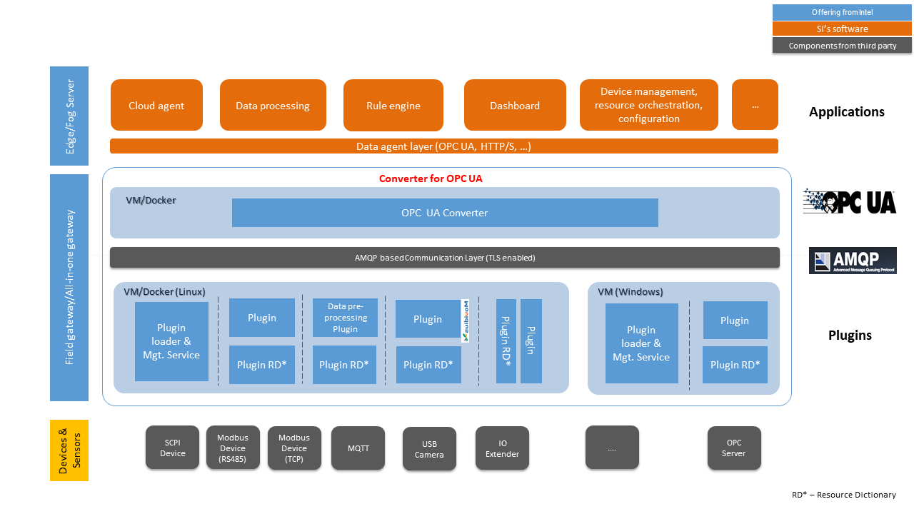

DISCONTINUATION OF PROJECT.

This project will no longer be maintained by Intel.

Intel has ceased development and contributions including, but not limited to, maintenance, bug fixes, new releases, or updates, to this project. 

Intel no longer accepts patches to this project.

If you have an ongoing need to use this project, are interested in independently developing it, or would like to maintain patches for the open source software community, please create your own fork of this project. 
# Converter for OPC UA

## Introduction

Converter for OPC UA is a general framework that not only connects different machines and sensors with different protocols in the factories but also convert them into unified [OPC UA](https://opcfoundation.org/about/opc-technologies/opc-ua/) access interfaces. Customized data preprocessing can also be done during the convertion. The software framework is designed for flexible deployment with mininum hardware change for the factory.

Manufacturing operation levels are diversified as many manufacturing are still at industry 1.0 or 2.0 level. The machines are not connected and factories lack automation solutions. This framework will help connecting the unconnected and unifying the data access for further analytics. 

## Features

* Extensible way to expose data to OPC UA
* Out-of-box supporting common protocols (SCPI, MQTT, Modbus etc.) and light plugin development effort for new protocols
* Flexible deployment model including Standalone, Edge Server+Edge Compute Node, Public Cloud+Edge Server+Edge Compute Node
* Use Memory, SQLite or MongoDB as history storage

## Architecture Overview

The architecture is as following:

Three key blocks have been introduced to support the core architecture: (1) OPC UA Converter; (2) AMQT based message broker; (3) Protocol plugin. RabbitMQ has been used as message broker because of its widely adoption. Resource dictionary(RD) concept was introduced to guide and simplify the converting process. RD will be transferred from plugin to converter by GETRD RPC invoking.

## Getting Started

### Requirements

The software can run on commodity PC, Server or IOT gateways. Our primary development OS is **Ubuntu 16.04 LTS**. As the code is developed primarily in Python. It should be straingforward to port to other platforms. 

There are two ways of running Converter for OPC UA:

* [Running Natively](#running-natively)
* [Running on Docker](#running-on-docker)
  
If you want to quickly try out or deploy in production environment, it's recommendated to run on Docker. Otherwise you can run natively as well to explore internals or develop plugins.

### Running Natively

* Install Dependencies

The easiest way of install dependencies is to run:

	$ ./bin/setup_env_ubuntu.sh

The script will install all system and python package dependencies and setup a [virtualenv](https://virtualenv.pypa.io) environments

If you prefer to manually install dependencies, please check the following helper scripts:

* `bin/install_system_deps.sh`: install system dependencies for ubuntu
* `bin/install_venv.sh`: install virtualenv
* `bin/install_python_venv_deps.sh`: install python dependencies and virtualenv

To only install python dependencies, run from home directory of the source:

    $ pip3 install -r requirements.txt

* Configuration

Edit `opcua_plugin/modules.conf` to uncomment plugins you want to run when starting the converter.

* Running

All the following commands run in the home directory of the source code.

If using virtualenv, you need to activate virtualenv environment first:

    $ source ./bin/activate_venv.sh

To start the converter, run:

    $ ./bin/start.sh

To stop the converter, run:

    $ ./bin/stop.sh

To restart the converter, run:

    $ ./bin/restart.sh

To show the converter status, run:

    $ ./bin/status.sh

### Running on Docker

Converter and Plugins could be running in the same or separated Docker containers. The following Dockfile Guides show how to make Converter or Plugin images.

* [Dockfile Converter Guide](Dockfile/converter/README.md)

* [Dockfile Plugin Guide](Dockfile/plugin/README.md)

## Running Tests

Functional test cases are placed in "tests" directory. Some unit tests are put in "unittest" directory along with the unit source code.

Check [tests/README.md](tests/README.md) for how to run tests.

## Using Plugins

Plugin is used to extend converter features such as adding new connection protocols. Plugins are placed in "opcua_plugin" directory.  They are categorized in C and Python plugin and put in "cmodules" and "pymodules" directories respectly. Check README file in each plugin's directory to learn. Edit `opcua_plugin/modules.conf` to add plugins you want to run when starting the converter. 

Check [Plugins](docs/plugins.md) for details.

## Using Interactive Console

A console-based interactive shell has been developed for debugging purpuse. Run:

	$ python3 tests/tools/console.py

Check [Console](docs/console.md) for details.

## Examples for Developing Client

`examples` directory contains some example files about how to use Python to develop OPC-UA client for using Converter for OPC UA.

## Frequently Asked Questions

Check [FAQ](docs/faq.md) for details.

## License

The source code is licensed under Apache License 2.0. See [LICENSE](LICENSE) file for details. 

It includes software developed from 3rd-party, See [NOTICE](NOTICE) file for details.

## Contributing

Please submit [Pull Requests](https://github.com/intel/Converter-for-OPCUA/pulls) or [Issues](https://github.com/intel/Converter-for-OPCUA/issues). Your contribution is very much appreciated!

## Contacts

For questions and issues regarding Converter for OPC UA, Please submit [Issues](https://github.com/intel/Converter-for-OPCUA/issues).
